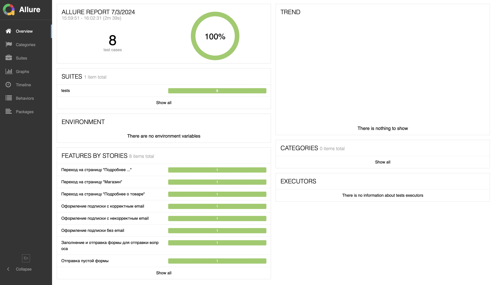
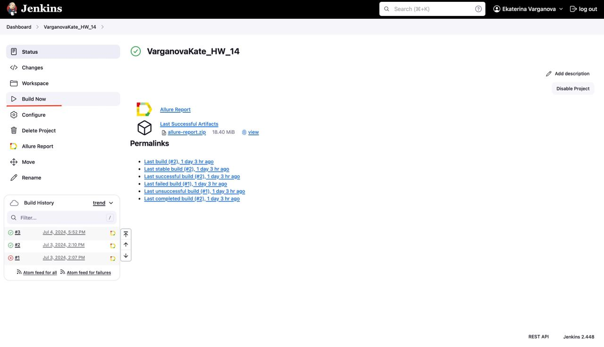
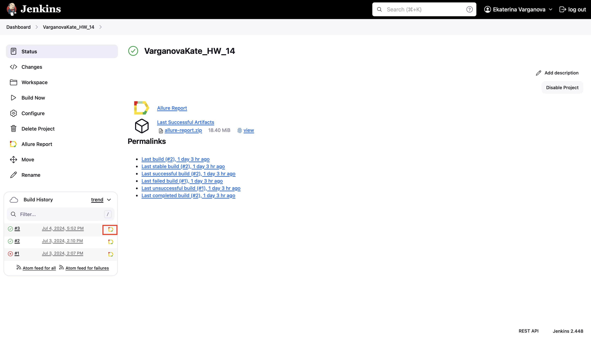
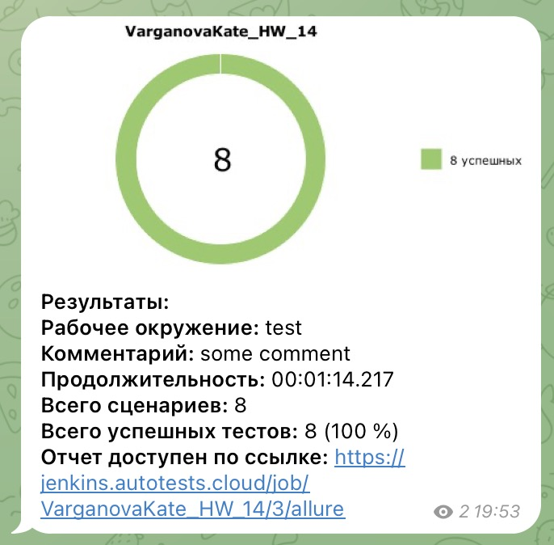

<p>
  <a href="https://guru.qahacking.ru">
  <picture>

    </picture>
  </a>
</p>

<p>
Тест-кейсы для тестового сайта питомника для собак "Собаседник"
</p>

## Используемые инструменты
<div>
&nbsp
&nbsp
&nbsp
&nbsp
&nbsp
&nbsp
&nbsp
&nbsp
&nbsp
</div>

## Запуск тестов и получение отчета

### **Локально**

<details><summary>1. Склонировать репозиторий</summary>

```
git clone https://github.com/KateVarg/HW_14.git
```
</details>

<details><summary>2. Установить зависимости и запустить тесты</summary>

```
python -m venv .venv
source .venv/bin/activate
pip install -r requirements.txt
pytest .
```
</details>

<details><summary>3. Получить отчет о прохождении тестов в allure</summary>

```
allure serve allure-results/
```
</details>

<details><summary>4. После выполнения команды откроется браузер с отчетом</summary>
    


</details>

### **Удалённо**

Удаленный запуск автотестов осуществляется при помощи Jenkins. Для этого необходимо выполнить следующие действия:

1. Открыть [проект на Jenkins] (https://jenkins.autotests.cloud/job/VarganovaKate_HW_14/)

<details><summary>2. Нажать на Build now</summary>



</details>

<details><summary>3. Дождаться окончания выполнения автотестов и нажать на иконку allure  для просмотра отчета</summary>



</details>

## **Дополнительно**

Реализована отправка результатов тестирования в Telegram   
<details><summary>Пример отчета</summary>



</details>

<details><summary>Пример видеоотчета о прохождении автотестов</summary>

<video src="resources/video_example.gif"></video>

</details>


